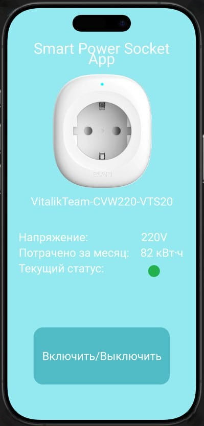

# Управление умной розеткой с raspberry pi с интеграцией в андроид приложением

Команда:
- Поважный Виталий Евгеньевич РИС-22-1б (jaken525) - Backend raspberry pi
- Карнаухов Михаил Евгеньевич РИС-22-1б (Suduppa) - Frontend android studio
- Вышенская Екатерина Игоревна РИС-22-1б (kotyasmol) - Backend android studio
- Зырянов Ростислав Александрович РИС-22-1б (Rostyan18) - Frontend android studio/manager

# Доска заданий
[Проект PowerSocket](https://github.com/users/jaken525/projects/3)

# Описание проекта

Полнофункциональная система «Умная розетка», построенная на микрокомпьютере Raspberry Pi. Устройство позволяет дистанционно управлять электроприборами через удобное Android-приложение, а также в реальном времени отслеживать ключевые параметры окружающей среды и сети благодаря подключенным датчикам.
____
__Какие будут запросы на raspberry pi__

| Запрос | Описание | 
| ------------- | ------------- | 
| /on | Включение розетки | 
| /off | Отключение розетки | 
| /toggle | Переключение состояния розетки | 
| /power | Текущая информация по датчикам | 
| /energy | Текущая энергия | 
| /stats | Статистика потребления |
| /status | Текущий статус состояния | 
| /health | Рабочее состояние | 

# Документация 
__Raspberry pi__
| Класс | Описание | 
| ------------- | ------------- | 
| Logger | Логирование | 
| ConfigManager | Работа с конфигурационным файлом | 
| GPIOController | Контроллер портов GPIO | 
| HTTPServer | Работа с запросами | 
| RelayController | Контроллер реле | 
| PowerMonitor | Мониторинг информации по датчикам |
| SensorManager | Работа с датчиками | 
| Statistics | Статистика по потреблению | 
____
__Android Studio__
____
Frontend

Фронтенд часть проекта SmartPowerSocket представляет собой мобильный интерфейс для управления умной розеткой и отображения её текущего состояния. Интерфейс ориентирован на простоту, наглядность и работу в реальном времени через взаимодействие с Raspberry Pi.

Основные элементы интерфейса:

__1.Напряжение__

Поле «Напряжение» отображает текущее значение напряжения (в вольтах), получаемое с датчика, установленного в розетке.  
Данные приходят с Raspberry Pi через бэкенд и отражают реальное состояние электросети.

__2.Потрачено за месяц__

Поле «Потрачено за месяц» — счётчик энергопотребления, отображающий суммарное количество израсходованной электроэнергии за текущий месяц (кВт·ч).  
Используется для статистики и анализа потребления подключённых устройств.

__3.Текущий статус__

Поле «Текущий статус» показывает состояние подключения к Raspberry Pi.  Зелёный индикатор — соединение активно, устройство доступно. Красный индикатор — соединение отсутствует или Raspberry Pi недоступен 
Статус обновляется на основе ответов бэкенда.

__4.Кнопка «Включить / Выключить» отвечает за управление состоянием розетки:__

- при нажатии отправляется HTTP-запрос на бэкенд
- бэкенд пересылает команду на Raspberry Pi
- Raspberry Pi включает или отключает питание розетки 

__Инфтерфейс__

Backend

Backend-часть Android-приложения отвечает за сетевое взаимодействие с Raspberry Pi, на котором запущен HTTP-сервер управления умной розеткой.

Android-приложение выступает в роли клиента, отправляя команды управления и получая данные о состоянии розетки и статистике энергопотребления.

__Архитектура сетевого слоя__

Backend Android-приложения реализован в виде отдельного сетевого слоя, что упрощает поддержку и расширение проекта.

Структура:

network/

├── ApiClient.kt      // Конфигурация Retrofit

├── ApiService.kt     // Описание HTTP-endpoints

└── models/           // Модели данных для JSON-ответов

__ApiClient__

Файл ApiClient.kt содержит конфигурацию HTTP-клиента и базовый адрес Raspberry Pi. 
Адрес и порт сервера Raspberry Pi настраиваются вручную.

__ApiService (HTTP API)__

Все HTTP-запросы описаны в интерфейсе ApiService.kt и соответствуют серверу на Raspberry Pi.

__Модели данных__

Ответы сервера автоматически преобразуются в Kotlin-модели:
- StatusResponse — состояние розетки (on/off)
- PowerResponse — параметры питания (напряжение, ток, энергия)
- EnergyResponse — статистика потребления

__Связь с UI__

Backend напрямую связан с элементами пользовательского интерфейса:

Кнопка «Включить / Выключить» → HTTP-запрос /toggle (отображения состояния розетки (зелёный / красный индикатор))

